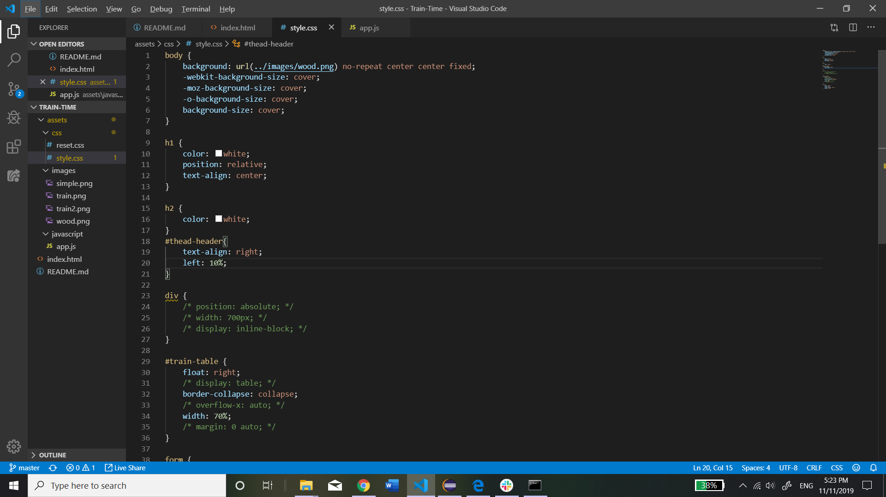

# Train-Time

The Assignment: To create a website that utilizes the firebase database to update the DOM. This particular assignment requires that information about a train be entered by the user, uploated to the database and updated on the DOM. To use Moment.js to perform calculations about train-related data.

How it works: When the user enters information into the input field and hits the submit button, that information is added as a child to the firebase database. Afterward, the database.on("value") function executes and dynamically updates that data onto the DOM. Moment.js is also used to make some calculations of when the next train will arrive and how many minutes away it is.

Screenshots:

index.html:

app.js:

style.css:

